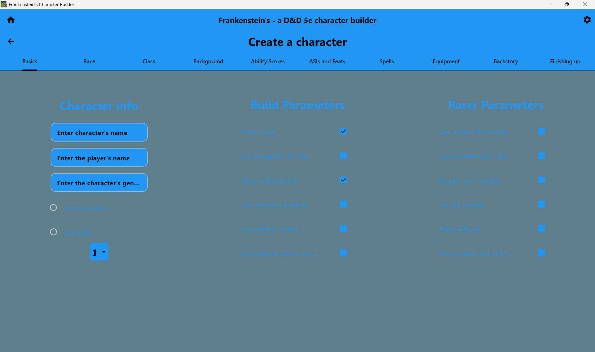
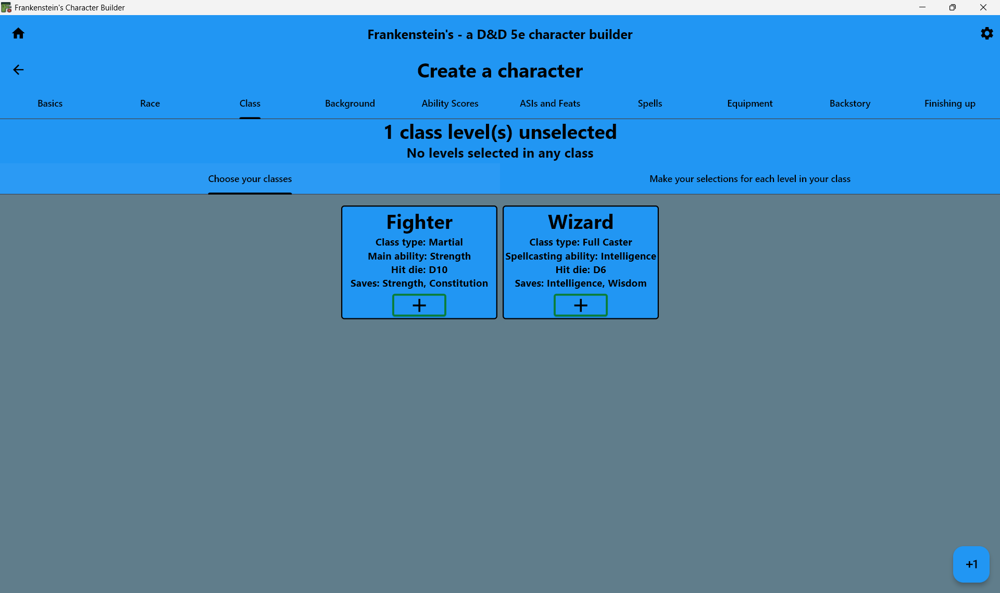
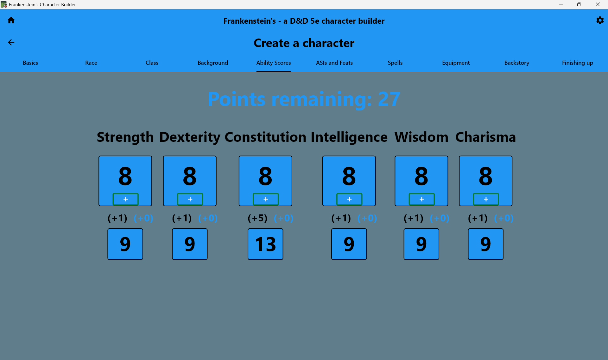
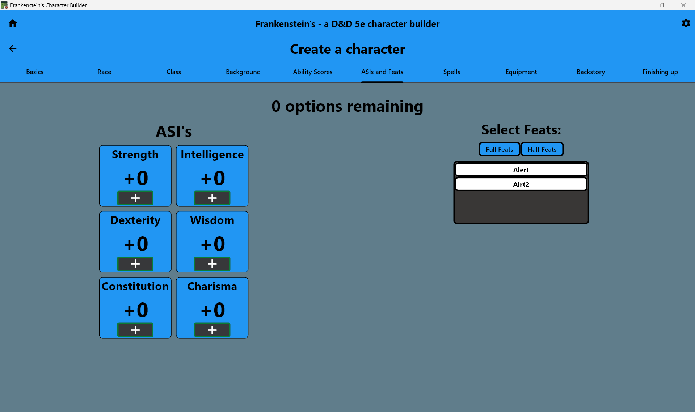
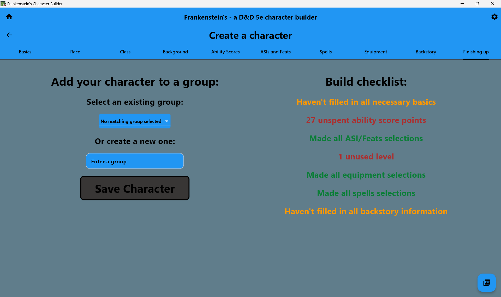

# Character Creation Feature

## Overview
Comprehensive character creation workflow using a tabbed interface for D&D 5e characters. Walks the user through all aspects of character building from basic info to equipment selection.

## Architecture Overview
```
features/character_creation/
├── screens/
│   └── character_creation_screen.dart  # Main tabbed interface
├── tabs/
│   ├── basics_tab.dart                 # Name, race, class selection
│   ├── ability_score_tab.dart          # Point buy system
│   ├── spells_tab.dart                 # Spellcaster spell selection
│   ...                                 # Other creation tabs
│   └── finishing_up_tab.dart           # Final validation
└── widgets/
    └── spell_handling.dart             # Spell list management
```

## Result
### Character Creation Screen


### Class Tab


### Ability Scores Tab


### ASIs & Feats Tab


### Finishing Up Tab


## Code
### Detailed Validation
```dart
// Multi-step validation with dependency checking
bool get canCreateCharacter {
  return (pointsRemaining == 0 &&
    numberOfRemainingFeatOrASIs == 0 &&
    !remainingAsi &&
    charLevel <= character.classList.length &&
    character.chosenAllEqipment && 
    character.chosenAllSpells
  );
}
```

### Dynamic Tab Building
```dart
// Dynamically built tabs from a tablist
DefaultTabController(
    length: tabLabels.length,
    child: Scaffold(
        backgroundColor: ThemeManager.instance.currentScheme.backgroundColour,
        appBar: StyleUtils.buildStyledAppBar(
            title: "Create a character",
            titleStyle: ...text styling...,
            bottom: TabBar(
                tabs: tabLabels.map((e) => StyleUtils.tabLabel(e)).toList(),
                indicatorColor: ThemeManager.instance.currentScheme.textColour,
            ),
        ),
        ...body...
    )
)
```

### Composition based tab creation
```dart
// Composed tab building using tab components and callbacks
FinishingUpTab(
    character: character,
    groupEnterController: groupEnterController,
    canCreateCharacter: canCreateCharacter,
    pointsRemaining: pointsRemaining,
    numberOfRemainingFeatOrASIs: numberOfRemainingFeatOrASIs,
    remainingAsi: remainingAsi,
    charLevel: charLevel,
    onCharacterChanged: () {
        setState(() {});
    },
    congratulationsTitle: 'Character Created!',
),
```

### Usage
```dart
import 'package:frankenstein/features/character_creation/character_creation.dart';

// Navigate to character creation
Navigator.push(context, MaterialPageRoute(
  builder: (context) => CharacterCreationScreen(),
));
```

## Dependencies
- Models: Character, Race, Class, Background, Feat, Spell
- Services: GlobalListManager for content loading
- Theme: ThemeManager for consistent styling
