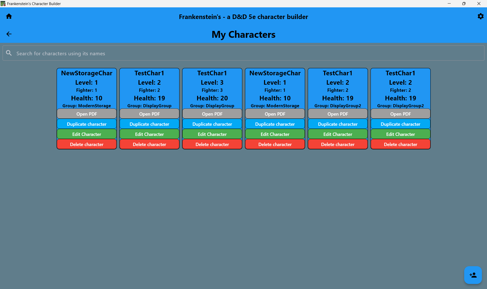
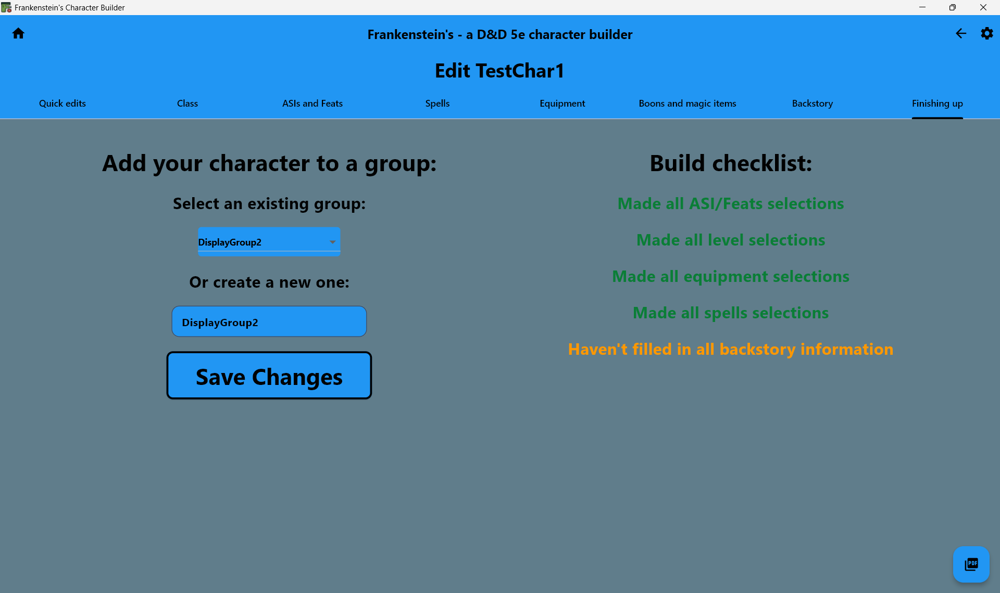
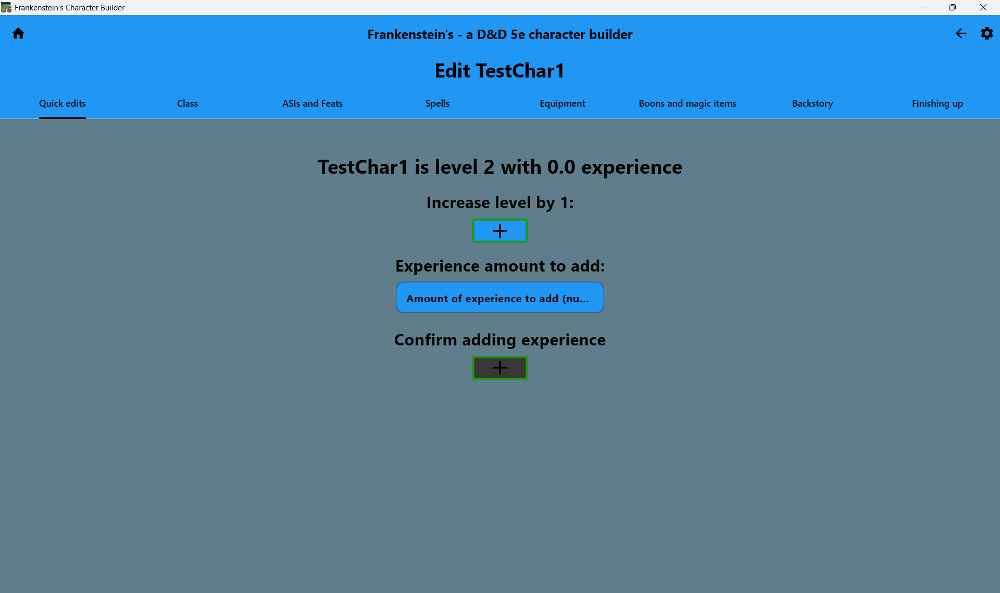

# Character Management Feature

## Overview
Character library and editing functionality. Allows users to view and edit their saved characters.

## Architecture Overview

The character management system provides UI for the  CRUD operations with efficient character storage and quick editing workflows:

```
features/character_management/
├── screens/
│   ├── view_characters_screen.dart     # Character library & search
│   └── character_editing_screen.dart   # Full character editor
├── tabs/
│   └── quick_edits_tab.dart            # Additional tab for level & experience adjustments
```

## Result
### Character Library View


### Edit Character Screen


### Quick Edits Tab


## Code
### Delegation To Class & Building Methods
```dart
/* Duplicate character button */
buildCharacterActionButton("Duplicate character", Colors.lightBlue, () async {
    final scaffoldMessenger = ScaffoldMessenger.of(context);
    try {
        Character selectedCharacter = filteredCharacters[index];
        Character duplicatedCharacter = selectedCharacter.getCopy();
        final saveResult  = await GlobalListManager().saveCharacter(duplicatedCharacter);
        if (saveResult) {
        setState(() {});
        } else {
        scaffoldMessenger.showSnackBar(
            const SnackBar(content: Text('Failed to duplicate character')),
        );
        }
    } catch (e) {
        debugPrint('Error duplicating character: $e');
        scaffoldMessenger.showSnackBar(
        const SnackBar(content: Text('Error duplicating character')),
        );
    }
}),
```

### Dynamic Tab Building
```dart
// Dynamically built tabs from a tablist
DefaultTabController(
    length: tabLabels.length,
    child: Scaffold(
        backgroundColor: ThemeManager.instance.currentScheme.backgroundColour,
        appBar: StyleUtils.buildStyledAppBar(
            title: "Create a character",
            titleStyle: ...text styling...,
            bottom: TabBar(
                tabs: tabLabels.map((e) => StyleUtils.tabLabel(e)).toList(),
                indicatorColor: ThemeManager.instance.currentScheme.textColour,
            ),
        ),
        ...body...
    )
)
```

## Usage
```dart
import 'package:frankenstein/features/character_management/character_management.dart';

// View character library
Navigator.push(context, MaterialPageRoute(
  builder: (context) => ViewCharactersScreen(),
));
```

## Dependencies
- Models: Character, CharacterDescription
- Storage: Character persistence and loading
- PDF Export: Integration for character sheet generation
