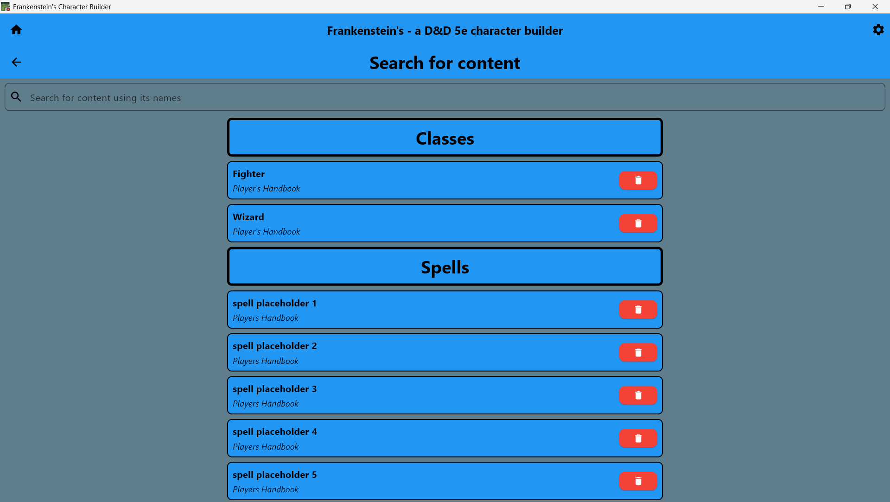
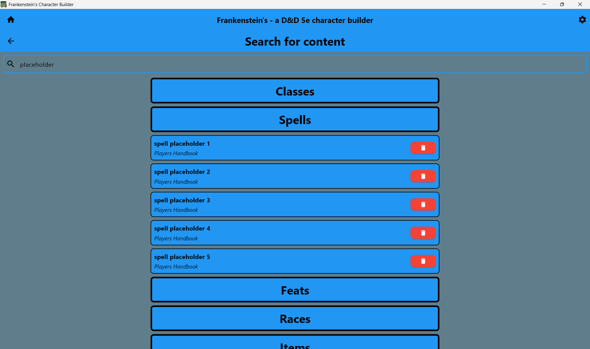

# Content Search Feature

## Overview
Search and browse the users downloaded D&D 5e content including spells, items, races, classes, and feats. Provides filtering and detailed content views.

## Architecture Overview
```
features/content_search/
├── screens/
│   └── content_search_screen.dart      # Main search interface
└── widgets/
    ├── content_card.dart               # Card displaying the information about a piece of content
    └── title_card.dart                 # Card displaying the section title
```

## Result
### Content Search Screen


### Content Search Example


## Code
### Interface backed programming
```dart
// Makes use of the underlying interface to display information
Center buildContentCard(Content content, List<Content> list, void Function(Content) onDelete) {
  return Center(child: FractionallySizedBox(
    widthFactor: 0.5,
    child: StyleUtils.buildStyledContainer(
      ...styling...,
      child: Row(
        mainAxisAlignment: MainAxisAlignment.spaceBetween,
        children: [
          /* Display content info */
          Column(
            crossAxisAlignment: CrossAxisAlignment.start,
            children: [
              Text(content.name, style: StyleUtils.buildDefaultTextStyle(fontWeight: FontWeight.bold, fontSize: 16)),
              const SizedBox(height: 4),
              Text(content.sourceBook, style: StyleUtils.buildDefaultTextStyle(fontSize: 14).copyWith(fontStyle: FontStyle.italic)),
            ]),
          ...buttons...
        ]
      )
  )));
}

```

### Usage
```dart
import 'package:frankenstein/features/content_search/content_search.dart';

// Open content browser
Navigator.push(context, MaterialPageRoute(
  builder: (context) => ContentSearchScreen(),
));
```

## Dependencies
- Models: All content models (Spell, Item, Race, Class, Feat, etc.)
- Services: Content loading and search indexing
- Storage: Content caching and user preferences
