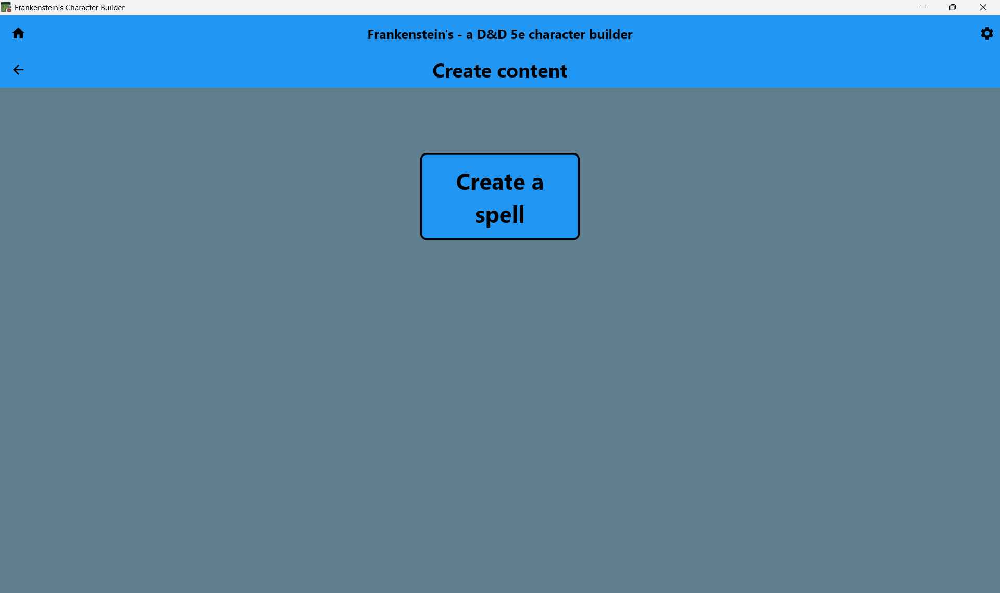
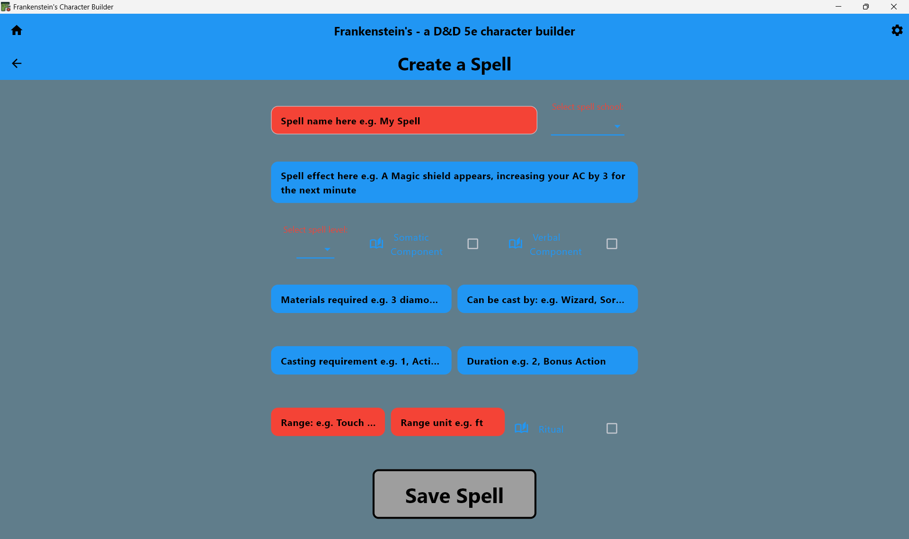

# Custom Content Feature

## Overview
Tool allowing users to create homebrew content. Users can create custom spells for their campaigns.

## Architecture Overview

The custom content system provides form-based content creation with validation and preview capabilities:

```
features/custom_content/
└── screens/
    ├── overview_screen.dart            # Custom content library
    └── spell_creation_screen.dart      # Spell creation form
```

## Results
### Custom Content Overview Screen


### Spell Creation Form


## Code
### Detailed Form Validation
The system uses a modular techniques to validate content according to D&D rules:
```dart
// Rigorous validation with D&D rule compliance
bool validateSpell() {
return validateName() 
    && validateLevel() 
    && validateSchool() 
    && validateRange();
}
```

### Usage
```dart
import 'package:frankenstein/features/custom_content/custom_content.dart';

// Create new custom content
Navigator.push(context, MaterialPageRoute(
  builder: (context) => SpellCreationScreen(),
));
```

## Dependencies
- Models: All content models for which creation forms are available
- Storage: Custom content persistence

## Future Enhancements
- [ ] **More supported content**: Create more forms to allow more content types to be created
