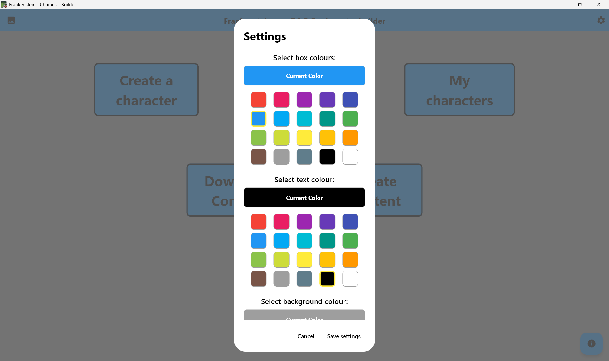

# Home Feature

## Overview
Application entry point with navigation menu and initial user experience. Provides access to all major app features.

## Architecture Overview

The home system serves as the central navigation hub with smart routing and feature discovery:

```
features/home/
├── screens/
│   └── home_screen.dart                # Main dashboard
└── widgets/
    └── initial_top.dart                # App header component
```

## Result
### Home Screen


### Colour Picker


## Code
### Smart Feature Navigation System
```dart
// Dynamicly and modularly created navigation boxes 
@override
Widget build(BuildContext context) {
    return StyleUtils.buildStyledScaffold(
        floatingActionButton: StyleUtils.buildStyledFloatingActionButton(
        onPressed: () {_showInfoAndHelp(context);},
        tooltip: "Help and guidance",
        child: const Icon(Icons.info)
        ),
        body: Column(
        crossAxisAlignment: CrossAxisAlignment.start,
        children: <Widget>[
            const SizedBox(height: 80),
            
            /* Row containing the create character, search for content and my characters buttons. */
            _buildMainNavigationRow(context),
            
            const SizedBox(height: 120),

            /* Row containing the download content and create content buttons */
            _buildSecondaryNavigationRow(context),
        ],
        )
    );
}
```

### Robust File Selection
```dart
// Function called when pressing the 'download content' button
Future<void> _handleDownloadContent(BuildContext context) async {
    final result = await FilePicker.platform.pickFiles(
      dialogTitle: "Navigate to and select a Json file to download the contents from, this content can then be used in your characters",
      type: FileType.custom,
      allowedExtensions: ["json"],
    );

    try {
      if (result == null) throw Exception("File cannot be found");
      if (result.files.single.path == null) throw Exception("File path is null");
      await GlobalListManager().loadContentFromFile(File(result.files.single.path!));
    } catch (err) {
      if (mounted) _showErrorDialog(context, err);
    }
  }
```

### Usage
```dart
import 'package:frankenstein/features/home/home.dart';

// App entry point
class MyApp extends StatelessWidget {
  Widget build(BuildContext context) {
    return MaterialApp(
      home: HomeScreen(),
    );
  }
}
```
## Dependencies
- **All** feature modules for navigation
- Theme: Consistent styling and branding
