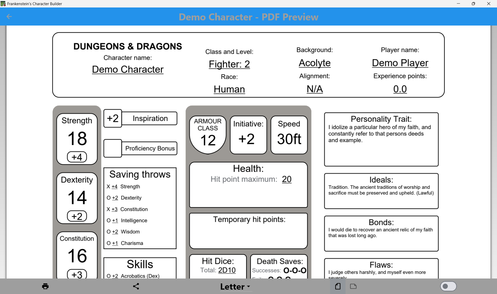

# PDF Character Sheet Generator

A modular PDF generation system for D&D 5e character sheet generation. This system employs a **Domain-Specific Language (DSL) approach** for clean, maintainable PDF composition.

## Architecture Overview
```
features/pdf_export/
├── screens/
│   └── pdf_display_screen.dart    # Preview widget
├── services/
│   ├── pdf_generator_service.dart # Main entry point
│   └── pdf_utils.dart             # Shared utilities & constants
└── widgets/
    └── first_page/
        ├── page.dart              # Page assembly & layout
        ...                        # Page-specific components
```

## Result


## Code
### DSL-Style Component System
This system uses a **declarative, composable approach** similar to modern UI frameworks:

```dart
// Clean, readable component composition
Widget buildAbilityScore(String name, AbilityScore score) {
  return Container(
    child: Column(
      children: [
        Text(name, style: boldHeader),
        buildModifierBox(score),
        buildScoreDisplay(score.value),
      ],
    ),
  );
}
```

### Modular Page Assembly
Pages are assembled from focused components:

```dart
Widget buildSkillLine(String skillName, Ability ability, bool isProficient) {
  return Container(
    height: 13,
    child: Row(
      children: [
        buildProficiencyIndicator(isProficient),
        buildModifierText(calculateModifier(ability, isProficient)),
        buildSkillNameText(skillName),
        buildAbilityLabel(ability),
      ],
    ),
  );
}
```

### Data-Driven Rendering
```dart
// All D&D skills rendered from clean data structure
  buildSkillLine("Acrobatics", Ability.DEXTERITY),
  buildSkillLine("Animal Handling", Ability.WISDOM),
  buildSkillLine("Arcana", Ability.INTELLIGENCE),
  ...
```

### Complex dependencies and rules
```dart
// Character skill proficiency calculations
final classSkills = (userCharacter.classList.isNotEmpty)
  ? GlobalListManager().classList.firstWhere((element) => userCharacter.classList.isNotEmpty && element.name == userCharacter.classList.first).optionsForSkillProficiencies.where(
    (element) => userCharacter.classSkillsSelected[GlobalListManager().classList.firstWhere(
      (element) => userCharacter.classList.isNotEmpty && element.name == userCharacter.classList.first
    ).optionsForSkillProficiencies.indexOf(element)]).toList()
  : [];

List<String> skills = [
  ...userCharacter.skillProficiencies,
  ...userCharacter.background.initialProficiencies,
  ...classSkills,
  ...userCharacter.skillsSelected
];
```

### Usage
```dart
// Floating button to display the generated pdf
floatingActionButton: FloatingActionButton(
  tooltip: "Generate a PDF",
  foregroundColor: ThemeManager.instance.currentScheme.textColour,
  backgroundColor: ThemeManager.instance.currentScheme.backingColour,
  onPressed: () {
    Navigator.of(context).push(
      MaterialPageRoute(
        builder: (context) => PdfDisplay(
            character: widget.character,
            isPreview: true,
        ),
      ),
    );
  },
  child: const Icon(Icons.picture_as_pdf),
),
```

## Dependencies
- **pdf**: PDF document generation
- **printing**: Preview and print functionality
- **flutter**: SDK integration

## Future Enhancements
- [ ] **Multi-page support**: Add more pages to generated PDFs
